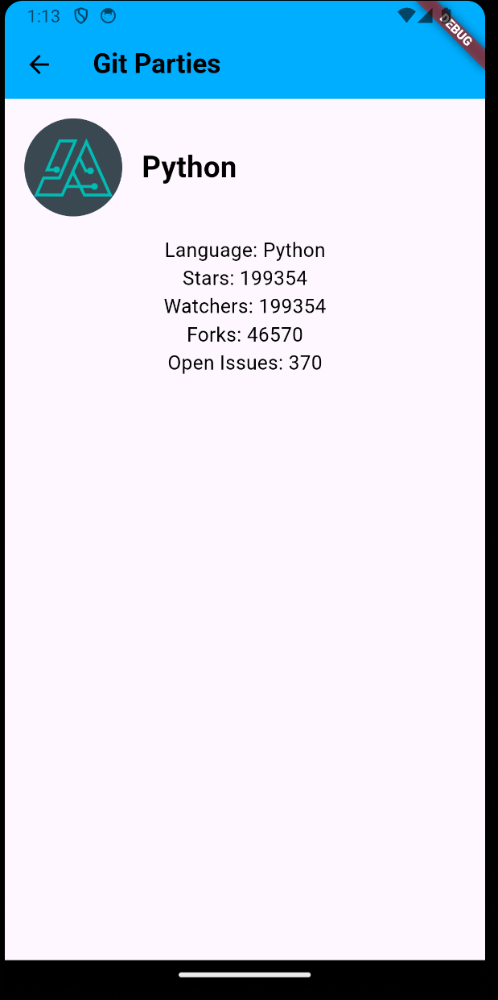

# git_parties
このアプリケーションはGithubのディレクトリを検索し、
詳細を確認できるモノである。

## 主な機能
<ul>
    <li>リポジトリ検索</li>
    <li>リポジトリの詳細を確認</li>
    <li>スター数やフォーク数などに基づく並び替え</li>
    <li>言語変更</li>
</ul>

## ディレクトリ
lib 
├materials 
│ └color_settting.dart→文字の色と背景色を変更 
│ └language_provider.dart→言語設定をするためのプロバイダー 
├screens 
│ └main_page.dart→起動後のページ 
│ └repogitories_specific.dart→起動後のページ 
└main.dart→プロジェクトを統括 

## こだわった点
<ul>
    <li>時間に基づいてappbarの背景を変える点(朝:薄い水色, 昼:水色, 夕:オレンジ, 夜:紺色 )</li>
    <li>並び替え(降順や昇順が可能)</li>
    <li>右上の地球ロゴを押したら英語及び日本語に変更が可能</li>
    <li>第３者によるフィードバック</li>
</ul>

## 作業日記

### 作業日程
4/8: FigmaによるUIデザイン 
4/12: 基本動作の実装(参考サイト: https://github.com/yumemi-inc/flutter-engineer-codecheck) 
4/13(予定):知人を通したテストプレイ, 言語設定 
4/14(予定): コメントアウト, UI修正 
4/15(予定): 全体的なリファクタリング 

### 日報
4/12
実装した内容 
・Github API全般について学んだ→実装すべき機能を実装した 

・検索画面 

・リポジトリの詳細 

4/15
実装した内容 
・時間に応じたbarの色の変更 
・言語変更 
・並び替え(降順や昇順が可能) 

・夕方に使用した場合の検索結果 

・英語表記 

・リポジトリの詳細 

### 知人に聞くテストプレイの指標
<ul>
    <li>良かった点</li>
    <li>改善点</li>
    <li>欲しい機能</li>
    <li>感想</li>
</ul>

4/14、1人のテストユーザーと対面で合うので、口頭で話す予定

### 得た内容
<ul>
    <li>良かった点</li>
    
・十分良い

    
・きれいにまとまっている

    
・UIは見やすい

    <li>改善点</li>
    
・検索最中でレコメンドを表示するとめちゃくちゃ良い

    <li>欲しい機能</li>
    
・検索バーをリッチにする→実装済み

    
・フォーク数や星の数で降順昇順にする→実装済み

    
</ul>

### errorの原因
・Methods can't be invoked in constant expressions.dart(const_eval_method_invocation) 
→色を更新する時は、constを使用していたため 
const: 値の変更ができない 

・The method '_getAppBarColor' isn't defined for the type '_HomePageState'. 
Try correcting the name to the name of an existing method, or defining a method named '_getAppBarColor'.dartundefined_method 
→別途ファイルとしてmaterials/color_setting.dartに色変更するための関数を定義 
→自身のスペルミスが原因 
・例 
誤: gettitletextcolor →正: getTitleTextColor 
