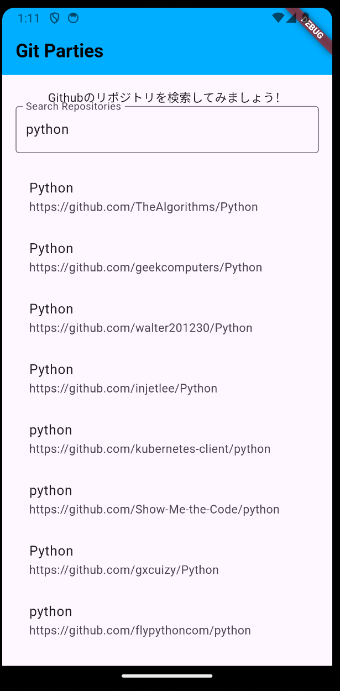

# git_parties
このアプリケーションはGithubのディレクトリを検索し、
詳細を確認できるモノである。

## 主な機能
<ul>
    <li>リポジトリ検索</li>
    <li>リポジトリの詳細を確認</li>
</ul>

## ディレクトリ

lib
├materials
│ └color_settting.dart→文字の色と背景色を変更
├screens
│ └main_page.dart→起動後のページ
│ └repogitories_specific.dart→起動後のページ
└main.dart→プロジェクトを統括

## 作業日記

### 作業日程
4/8: FigmaによるUIデザイン
4/12: 基本動作の実装(参考サイト: https://github.com/yumemi-inc/flutter-engineer-codecheck)
4/13(予定):知人を通したテストプレイ, 横向きの実装, 言語設定
4/14(予定):CodeMagicの使用, コメントアウト, UI修正
4/15(予定): 全体的なリファクタリング

### 日報
4/12
実装した内容
・Github API全般について学んだ→実装すべき機能を実装した

### 知人に聞くテストプレイの指標
<ul>
    <li>良かった点</li>
    <li>改善点</li>
    <li>欲しい機能</li>
    <li>感想</li>
</ul>

対面で合うので、口頭で話す予定

### errorの原因
・Methods can't be invoked in constant expressions.dart(const_eval_method_invocation)
→色を更新する時は、constを使用していたため
const: 値の変更ができない

・The method '_getAppBarColor' isn't defined for the type '_HomePageState'.
Try correcting the name to the name of an existing method, or defining a method named '_getAppBarColor'.dartundefined_method
→別途ファイルとしてmaterials/color_setting.dartに色変更するための関数を定義
→自身のスペルミスが原因
・例
誤: gettitletextcolor →正: getTitleTextColor